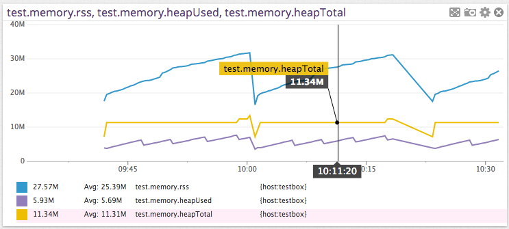

# datadog-metrics
> Buffered metrics reporting via the DataDog HTTP API.

[![NPM Version][npm-image]][npm-url]
[![Build Status][travis-image]][travis-url]

## Installation

```sh
npm install datadog-metrics --save
```

## Example



Save the following into a file named `example_app.js`:
```js
var metrics = require('datadog-metrics');
metrics.init({ host: 'testbox', prefix: 'test.' });

function collectMemoryStats() {
    var memUsage = process.memoryUsage();
    metrics.gauge('memory.rss', memUsage.rss);
    metrics.gauge('memory.heapTotal', memUsage.heapTotal);
    metrics.gauge('memory.heapUsed', memUsage.heapUsed);
};

setInterval(collectMemoryStats, 5000);
```

Run it:
```sh
DATADOG_API_KEY=YOUR_KEY DEBUG=metrics node example_app.js
```


## Usage

### DataDog API key

Make sure the `DATADOG_API_KEY` environment variable is set to your DataDog
API key. You can find the API key under [Integrations > APIs](https://app.datadoghq.com/account/settings#api). **You only need to provide the API key, not the APP key.**

### Module setup

Just require `datadog-metrics` and you're ready to go.

```js
var metrics = require('datadog-metrics');
```

At this point you can call `gauge`, `increment` and `histogram` to start
reporting metrics.

If you want more control you can configure the module with a call to `init()`:

```js
metrics.init({
    // Sets the hostname reported with each metric.
    host: 'myhost',

    // Sets a default prefix for all metrics.
    // Use this to namespace your metrics.
    prefix: 'test_app.',

    // How often to send metrics to DataDog.
    // This defaults to 15 seconds. Set it to 0 to disable
    // auto-flushing which means you must call metrics.flush() yourself.
    flushIntervalSeconds: 10,

    // DataDog API key. It's usually better to keep this
    // in an environment variable. datadog-metrics looks for
    // the API key in `DATADOG_API_KEY` by default.
    apiKey: 'MYTESTKEY'
});
```

If you need even more control you can create a `BufferedMetricsLogger` instance
and manage it yourself:

```js
var metrics = require('datadog-metrics');
var metricsLogger = new metrics.BufferedMetricsLogger({
    apiKey: 'TESTKEY',
    host: 'myhost',
    prefix: 'myapp.',
    flushIntervalSeconds: 15
});
metricsLogger.gauge('mygauge', 42);
```

### Gauges

`metrics.gauge(key, value[, tags])`

Record the current *value* of a metric. They most recent value in
a given flush interval will be recorded. Optionally, specify a set of
tags to associate with the metric. This should be used for sum values
such as total hard disk space, process uptime, total number of active
users, or number of rows in a database table.

Example:

```js
metrics.gauge('test.mem_free', 23);
```

### Counters

`metrics.increment(key[, value[, tags]])`

Increment the counter by the given *value* (or `1` by default). Optionally,
specify a list of *tags* to associate with the metric. This is useful for
counting things such as incrementing a counter each time a page is requested.

Example:

```js
metrics.increment('test.requests_served');
metrics.increment('test.awesomeness_factor', 10);
```

### Histograms

`metrics.histogram(key, value[, tags])`

Sample a histogram value. Histograms will produce metrics that
describe the distribution of the recorded values, namely the minimum,
maximum, average, count and the 75th, 85th, 95th and 99th percentiles.
Optionally, specify a list of *tags* to associate with the metric.

Example:

```js
metrics.histogram('test.service_time', 0.248);
```

## Logging

Datadog-metrics uses the [debug](https://github.com/visionmedia/debug)
library for logging at runtime. You can enable debug logging by setting
the `DEBUG` environment variable to `metrics` when you run your app.

Example:

```sh
DEBUG=metrics node app.js
```

## Tests

```sh
npm test
```

## Release History

* 0.0.0 Work in progress
* 0.1.0 The first real release
* 0.1.1 Allow increment() to be called with just a key
* 0.2.0 API redesign, removed setDefaultXYZ() and added init()

## Meta

This module is heavily inspired by the Python [dogapi module](https://github.com/DataDog/dogapi).

Daniel Bader – [@dbader_org](https://twitter.com/dbader_org) – mail@dbader.org

Distributed under the MIT license. See ``LICENSE`` for more information.

[https://github.com/dbader/node-datadog-metrics](https://github.com/dbader/node-datadog-metrics)

[npm-image]: https://img.shields.io/npm/v/datadog-metrics.svg?style=flat-square
[npm-url]: https://npmjs.org/package/datadog-metrics
[travis-image]: https://img.shields.io/travis/dbader/node-datadog-metrics/master.svg?style=flat-square
[travis-url]: https://travis-ci.org/dbader/node-datadog-metrics
